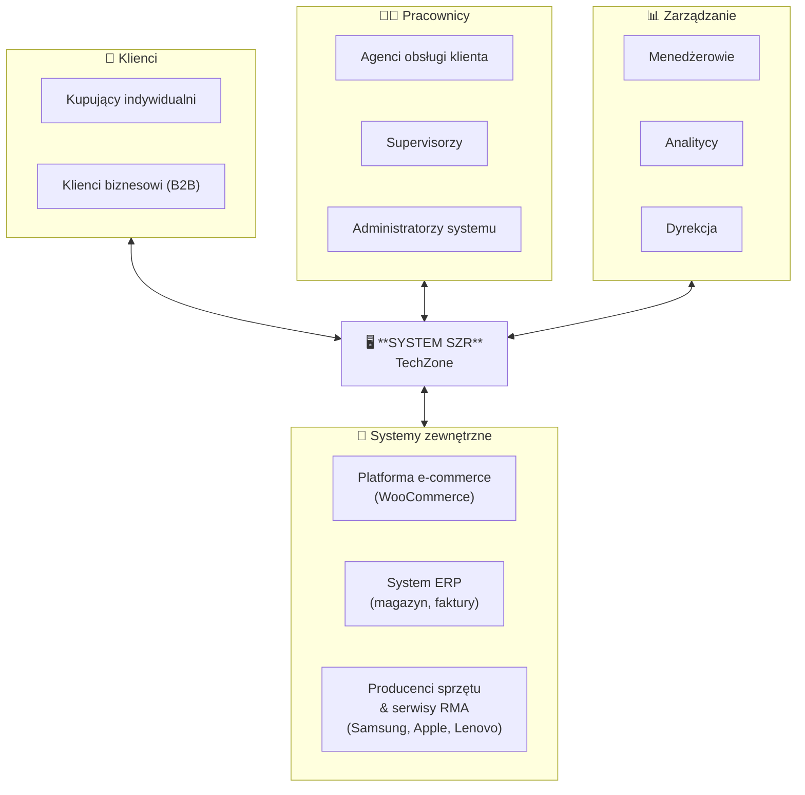
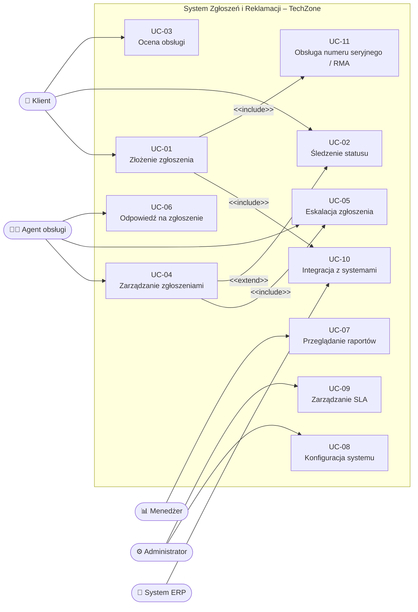
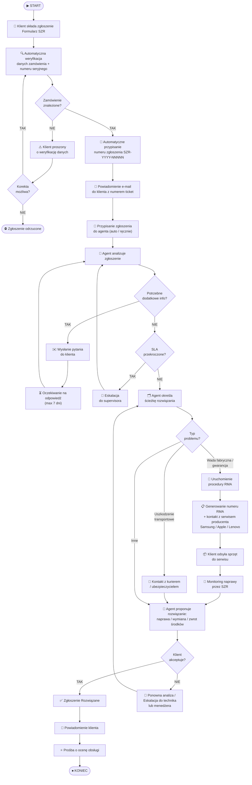

# System Zgłoszeń i Reklamacji dla Internetowego Sklepu z Elektroniką
## Specyfikacja Wymagań Oprogramowania (SRS)
### Zgodna ze standardem IEEE 830 oraz podejściem Volere

---

**Projekt grupowy – Inżynieria Wymagań**
**Przedmiot:** Inżynieria Wymagań
**Temat:** System Zgłoszeń i Reklamacji dla Internetowego Sklepu z Elektroniką
**Skład zespołu:** Dawid Kusion, Mateusz Trzeciak, Wiktor Warmuz
**Data:** 19 czerwca 2025

| Pole | Wartość |
|------|---------|
| Wersja dokumentu | 1.0 |
| Status | Finalny |
| Autorzy | Członek 1: Dawid Kusion (Interesariusz), Członek 2: Wiktor Warmuz (Użytkownik końcowy), Członek 3 Matusz Trzeciak (Administrator/Analityk biznesowy) |

---

## Spis treści

1. Kontekst i interesariusze
2. Pozyskiwanie wymagań
3. Specyfikacja wymagań
4. Modelowanie
5. Priorytetyzacja wymagań (MoSCoW)
6. Walidacja wymagań
7. Zarządzanie zmianą
8. Role-playing – zapis analizy
9. Dokumentacja Volere
10. Słownik pojęć

---

## 1. Kontekst i interesariusze

### 1.1 Opis kontekstu systemu

Sklep internetowy „TechZone" specjalizuje się w sprzedaży sprzętu elektronicznego – laptopów, smartfonów, telewizorów, AGD i akcesoriów – i obsługuje rocznie ponad 60 000 zamówień. Branża elektroniczna cechuje się szczególnie wysokim odsetkiem reklamacji (uszkodzenia transportowe, wady fabryczne, niezgodność oprogramowania) i długimi procedurami gwarancyjnymi angażującymi producentów. Obecnie reklamacje obsługiwane są przez e-mail oraz telefon, co powoduje brak automatyzacji, trudności w śledzeniu statusu i długi czas reakcji (średnio 96h). Klienci skarżą się na brak informacji zwrotnej i konieczność wielokrotnego kontaktu przy skomplikowanych sprawach technicznych. Celem projektu jest opracowanie dedykowanego **Systemu Zgłoszeń i Reklamacji (SZR)**, który usprawni ten proces, skróci czas rozwiązywania spraw, umożliwi obsługę gwarancji producenta i podniesie satysfakcję klientów.

System SZR będzie zintegrowany z istniejącą platformą e-commerce, bazą zamówień i systemem ERP. Użytkownicy będą mogli składać zgłoszenia przez panel klienta, aplikację mobilną lub e-mail (automatyczna konwersja). Pracownicy obsługi będą zarządzać zgłoszeniami w dedykowanym panelu agenta. Kadra zarządzająca uzyska dostęp do raportów i statystyk.

### 1.2 Identyfikacja użytkowników systemu

| ID | Użytkownik | Opis |
|----|-----------|------|
| U1 | Klient (Kupujący) | Osoba fizyczna lub firma, która złożyła zamówienie na sprzęt elektroniczny i chce zgłosić reklamację, usterkę techniczną lub problem z dostawą |
| U2 | Agent obsługi klienta | Pracownik sklepu z podstawową wiedzą techniczną o elektronice, rozpatrujący zgłoszenia i koordynujący naprawy/wymianę |
| U3 | Menedżer/Supervisor | Nadzoruje pracę agentów, rozpatruje eskalacje |
| U4 | Administrator systemu | Zarządza konfiguracją systemu, uprawnieniami, kategoriami |
| U5 | Technik serwisowy | Specjalista oceniający zgłoszenia wymagające diagnozy technicznej (np. wady sprzętu, problemy z oprogramowaniem) |
| U6 | System zewnętrzny (ERP/e-commerce) | Systemy integrowane automatycznie (API) |

### 1.3 Mapa interesariuszy

**Analiza interesariuszy wg wpływu i zainteresowania:**

| Interesariusz | Wpływ | Zainteresowanie | Strategia |
|---------------|-------|-----------------|-----------|
| Klienci | Wysoki | Wysoki | Aktywne zaangażowanie – kluczowi użytkownicy |
| Zarząd sklepu | Wysoki | Wysoki | Ścisła współpraca, raportowanie |
| Agenci obsługi | Średni | Wysoki | Regularne konsultacje, testy UAT |
| Dział IT | Wysoki | Średni | Integracja techniczna |
| Producenci sprzętu / serwisy RMA | Średni | Średni | Wymiana informacji o procedurach gwarancyjnych |

---

## 2. Pozyskiwanie wymagań

### 2.1 Zastosowane techniki

#### Technika 1: Wywiady z interesariuszami (Role-playing)

**Opis:** Przeprowadzono wywiady ustrukturyzowane w formie role-playing. Każdy członek zespołu wcielił się w rolę konkretnego interesariusza:

- **Członek 1 (Klient):** _„Kupiłem laptopa za 4 000 zł i po miesiącu przestał się ładować. Chcę złożyć reklamację online i wiedzieć, czy dostanę naprawę, wymianę czy zwrot – bez dzwonienia i tłumaczenia technikowi przez telefon co mam na ekranie."_
- **Członek 2 (Agent obsługi):** _„Mamy reklamacje dotyczące smartfonów, lodówek i słuchawek – każda wymaga innej procedury i innego formularza producenta. Potrzebuję systemu, który mi powie, co zrobić z danym sprzętem i jakie dokumenty zebrać."_
- **Członek 3 (Menedżer/Administrator):** _„Chcę widzieć, które modele sprzętu mają największy odsetek reklamacji – to pozwoli mi negocjować z dostawcami i wycofać wadliwe partie. Potrzebuję też móc samodzielnie konfigurować kategorie i procedury dla nowych producentów bez angażowania programistów."_

**Kluczowe pytania zadane w wywiadach:**
1. Jakie są główne bolączki obecnego procesu reklamacyjnego?
2. Jakie informacje są potrzebne przy składaniu zgłoszenia?
3. Jakie powiadomienia powinien otrzymywać klient?
4. Jakie raporty są niezbędne dla zarządzania?
5. Z jakimi systemami musi być zintegrowany SZR?

**Wyniki:** Zebrano 47 wymagań wstępnych, z których wyodrębniono 20 funkcjonalnych i 10 niefunkcjonalnych po deduplikacji i analizie.

#### Technika 2: Analiza konkurencji

**Opis:** Przeanalizowano systemy reklamacyjne czterech konkurencyjnych sklepów internetowych oraz trzech dedykowanych platform (Zendesk, Freshdesk, Jira Service Management).

| Funkcjonalność | TechZone (obecny) | x-kom | Media Expert | Zendesk |
|---------------|-----------------|---------|---------|---------|
| Panel śledzenia statusu | ❌ | ✅ | ✅ | ✅ |
| Automatyczne powiadomienia | ❌ | ✅ | ✅ | ✅ |
| Baza wiedzy / FAQ | ❌ | ✅ | ❌ | ✅ |
| SLA / czas odpowiedzi | ❌ | ✅ | ✅ | ✅ |
| Ocena obsługi | ❌ | ✅ | ✅ | ✅ |
| API integracyjne | Częściowo | ✅ | ✅ | ✅ |
| Raportowanie | ❌ | Ograniczone | ✅ | ✅ |

**Wnioski:** x-kom i Media Expert posiadają dedykowane panele reklamacyjne z numerem RMA i statusem naprawy. SZR powinien dorównać im w zakresie śledzenia napraw i dodać raportowanie wadliwości modeli na poziomie Zendesk, czego konkurencja nie oferuje.

#### Technika 3: Analiza dokumentacji istniejącej

**Opis:** Przeanalizowano logi e-mailowe z ostatnich 6 miesięcy (1 450 zgłoszeń), regulamin sklepu TechZone w zakresie reklamacji i gwarancji, karty gwarancyjne kluczowych producentów (Samsung, Apple, Lenovo, Bosch) oraz obowiązujące przepisy prawa (Ustawa o prawach konsumenta z 30.05.2014, Kodeks cywilny, Dyrektywa UE 2019/771 o sprzedaży towarów).

**Wyniki analizy logów (specyfika branży elektronicznej):**
- 32% zgłoszeń dotyczy wad fabrycznych sprzętu (martwe piksele, awarie baterii, usterki oprogramowania)
- 24% – uszkodzeń transportowych (szczególnie duży sprzęt AGD i telewizory)
- 18% – towarów niezgodnych z opisem (błędna specyfikacja techniczna, brak zapowiadanych funkcji)
- 14% – problemów z naprawą gwarancyjną (spory z serwisami producentów, długi czas naprawy)
- 8% – zwrotów w ramach prawa odstąpienia od umowy (14 dni)
- 4% – innych (problemy z konfiguracją, oprogramowaniem)

Czas rozwiązania: mediana = 7 dni roboczych, maksimum = 30 dni (sprawy wymagające kontaktu z serwisem producenta).

### 2.2 Uzasadnienie wyboru metod

| Metoda | Uzasadnienie |
|--------|-------------|
| Wywiady + role-playing | Pozwalają uchwycić perspektywę każdej grupy użytkowników; role-playing eliminuje „efekt grzeczności" – intere sariusze w roli swobodniej artykułują potrzeby i frustracje |
| Analiza konkurencji | Dostarcza benchmarku rynkowego; identyfikuje funkcjonalności oczekiwane jako standard branżowy, minimalizuje ryzyko pominięcia ważnych wymagań |
| Analiza dokumentacji | Opiera wymagania na danych historycznych, a nie opiniach; pozwala zidentyfikować wzorce i priorytety bez subiektywnych zniekształceń |

Kombinacja tych trzech metod pozwoliła triangulować wymagania – potwierdzić je z co najmniej dwóch niezależnych źródeł, co zwiększa ich wiarygodność.

---

## 3. Specyfikacja wymagań

### 3.1 Wymagania funkcjonalne

| ID | Nazwa | Opis | Priorytet | Źródło |
|----|-------|------|-----------|--------|
| WF-01 | Składanie zgłoszenia przez klienta | Klient może złożyć zgłoszenie reklamacyjne przez panel klienta, podając: numer zamówienia, kategorię problemu, opis, zdjęcia/dokumenty | Must | U1, Wywiad |
| WF-02 | Automatyczne przypisanie numeru zgłoszenia | System automatycznie generuje unikalny numer zgłoszenia (ticket ID) w formacie SZR-YYYY-NNNNN | Must | Analiza konkurencji |
| WF-03 | Śledzenie statusu zgłoszenia | Klient może w każdej chwili sprawdzić status zgłoszenia (Nowe, W trakcie, Oczekuje na info, Rozwiązane, Zamknięte) | Must | U1, Wywiad |
| WF-04 | Automatyczne powiadomienia e-mail/SMS | System wysyła powiadomienie przy zmianie statusu, z informacją o oczekiwanym czasie rozwiązania | Must | U1, Analiza konkurencji |
| WF-05 | Zarządzanie kolejką zgłoszeń przez agenta | Agent widzi listę zgłoszeń posortowaną wg priorytetu i daty; może filtrować, sortować, przejmować zgłoszenia | Must | U2, Wywiad |
| WF-06 | Odpowiadanie na zgłoszenie | Agent może odpowiedzieć na zgłoszenie; klient otrzymuje powiadomienie i może odpisać (wątek konwersacji) | Must | U1, U2 |
| WF-07 | Eskalacja zgłoszenia | Agent może eskalować zgłoszenie do supervisora; system automatycznie eskaluje po przekroczeniu SLA | Must | U2, U3 |
| WF-08 | Kategoryzacja zgłoszeń | Zgłoszenia przypisywane są do kategorii (wada fabryczna, uszkodzenie transportowe, niezgodność z opisem, gwarancja producenta, zwrot, dostawa, płatność, inne); kategorie konfigurowalne przez admina | Must | U4, Analiza dok. |
| WF-09 | Załączanie plików | Klient i agent mogą dołączać pliki (zdjęcia, nagrania wideo usterki, faktury, karty gwarancyjne, dokumenty) – max 5 plików po 20 MB; dozwolone typy: JPG, PNG, PDF, DOC, MP4 | Must | U1, Wywiad |
| WF-10 | Automatyczna integracja z zamówieniami | System automatycznie pobiera dane zamówienia po wpisaniu numeru – produkty, kwoty, dane dostawy, numer seryjny urządzenia, model i datę zakupu (wymagane do procedur gwarancyjnych) | Must | U2, Analiza dok. |
| WF-11 | Obsługa reguł SLA | Administrator definiuje czas odpowiedzi i rozwiązania dla każdej kategorii; system ostrzega przy zbliżającym się naruszeniu | Should | U3, U4 |
| WF-12 | Raporty i statystyki | Menedżer ma dostęp do raportów: liczba zgłoszeń wg kategorii/czasu/agenta, średni czas rozwiązania, % zgłoszeń w SLA | Should | U5, Wywiad |
| WF-13 | Ocena obsługi przez klienta | Po zamknięciu zgłoszenia klient może ocenić obsługę (1–5 gwiazdek + komentarz) | Should | Analiza konkurencji |
| WF-14 | Szablony odpowiedzi | Agent może korzystać z predefiniowanych szablonów wiadomości, edytowalnych przez admina | Should | U2, Analiza konkurencji |
| WF-15 | Automatyczne przypisanie agenta | System może automatycznie przypisać zgłoszenie do agenta wg kategorii, obciążenia lub okrągłego rozdziału | Could | U3 |
| WF-16 | Baza wiedzy / FAQ | Przy składaniu zgłoszenia system podpowiada artykuły z bazy wiedzy pasujące do opisu | Could | Analiza konkurencji |
| WF-17 | Eksport danych | Możliwość eksportu zgłoszeń do CSV/Excel | Could | U5 |
| WF-18 | Historia zmian zgłoszenia | System rejestruje pełny log wszystkich zmian zgłoszenia (kto, kiedy, co zmienił) | Must | U3, Przepisy prawa |
| WF-19 | Zarządzanie uprawnieniami | Administrator definiuje role (klient, agent, supervisor, admin, analityk) i uprawnienia dla każdej roli | Must | U4 |
| WF-20 | Integracja API z platformą e-commerce i ERP | System udostępnia REST API do integracji z istniejącymi systemami; obsługuje webhooks | Must | U6, Analiza dok. |
| WF-21 | Obsługa numeru seryjnego i modelu sprzętu | Formularz zgłoszenia zawiera pola dla numeru seryjnego i modelu urządzenia; dane walidowane wg bazy produktów; wymagane przy zgłoszeniach gwarancyjnych | Must | U1, U2, Analiza dok. |
| WF-22 | Ścieżka gwarancji producenta (RMA) | System obsługuje ścieżkę RMA (Return Merchandise Authorization) – generuje numer RMA, integruje się z procedurami wybranych producentów (Samsung, Apple, Lenovo) | Should | U2, U3, Wywiad |

### 3.2 Wymagania niefunkcjonalne

| ID | Kategoria | Wymaganie | Miara |
|----|-----------|-----------|-------|
| WN-01 | Wydajność | Czas ładowania listy zgłoszeń ≤ 2 sekundy przy 1 000 równoczesnych użytkownikach | Test wydajnościowy (JMeter) |
| WN-02 | Wydajność | System obsługuje co najmniej 500 nowych zgłoszeń dziennie | Test obciążeniowy |
| WN-03 | Dostępność | System dostępny 99,5% czasu miesięcznie (planowane okna serwisowe max 4h/miesiąc) | Monitoring uptime |
| WN-04 | Bezpieczeństwo | Dane klientów szyfrowane AES-256 w spoczynku i TLS 1.3 w transmisji | Audyt bezpieczeństwa |
| WN-05 | Bezpieczeństwo | Zgodność z RODO: dane osobowe przetwarzane zgodnie z polityką prywatności, możliwość eksportu/usunięcia danych na żądanie | Audyt prawny, testy |
| WN-06 | Użyteczność | Klient składa zgłoszenie w max 5 krokach / 3 minutach (nowy użytkownik) | Test UX z 5 użytkownikami |
| WN-07 | Użyteczność | Interfejs responsywny, działa poprawnie na urządzeniach mobilnych (min. 320px szerokości) | Testy na urządzeniach |
| WN-08 | Skalowalność | Architektura umożliwia poziome skalowanie do 10x obecnego ruchu bez zmian kodu | Dokument architektury |
| WN-09 | Utrzymywalność | Kod pokryty testami jednostkowymi w min. 80%; dokumentacja techniczna API | Raport pokrycia kodu |
| WN-10 | Integracja | API zgodne ze standardem REST/JSON; dokumentacja OpenAPI 3.0; czas odpowiedzi API ≤ 500ms | Test integracyjny |

### 3.3 User Stories

### 👤 Perspektywa: Użytkownik końcowy

> Użytkownicy końcowi to osoby, które bezpośrednio wchodzą w interakcję z systemem: klienci składający zgłoszenia oraz agenci obsługi rozpatrujący je na co dzień. Ich potrzeby koncentrują się na prostocie, szybkości i jasności działania interfejsu.

**US-01 – Złożenie reklamacji online**
> _Jako **klient sklepu TechZone**, chcę **złożyć reklamację online bez konieczności dzwonienia na infolinię**, aby **zaoszczędzić czas, mieć pisemny ślad zgłoszenia i nie tłumaczyć problemu technicznego przez telefon**._

| Pole | Wartość |
|------|---------|
| Rola | Użytkownik końcowy – Klient |
| Priorytet | Must Have |
| Powiązane WF | WF-01, WF-02, WF-04 |

Kryteria akceptacji:
- Formularz reklamacyjny dostępny po zalogowaniu w sekcji „Moje zamówienia"
- Numer zamówienia można wpisać ręcznie lub wybrać z listy ostatnich zamówień
- Po wysłaniu klient otrzymuje e-mail potwierdzający z numerem ticket w ciągu 2 minut
- Formularz działa poprawnie na urządzeniu mobilnym

**US-02 – Śledzenie statusu zgłoszenia**
> _Jako **klient**, chcę **śledzić status swojego zgłoszenia reklamacyjnego w czasie rzeczywistym**, aby **wiedzieć, na jakim etapie jest moja sprawa, bez konieczności wielokrotnego kontaktowania się z obsługą**._

| Pole | Wartość |
|------|---------|
| Rola | Użytkownik końcowy – Klient |
| Priorytet | Must Have |
| Powiązane WF | WF-03, WF-04 |

Kryteria akceptacji:
- Status zgłoszenia widoczny w panelu klienta z opisem słownym każdego etapu
- Automatyczne powiadomienie SMS lub e-mail przy każdej zmianie statusu
- Widoczny szacowany czas rozwiązania zgodny z SLA kategorii

**US-03 – Dołączanie dowodów usterki**
> _Jako **klient**, chcę **dołączyć zdjęcia i nagranie wideo pokazujące usterkę urządzenia elektronicznego**, aby **wesprzeć reklamację konkretnym dowodem, szczególnie przy wadach trudnych do opisania słowami, takich jak migający ekran czy przerywający dźwięk**._

| Pole | Wartość |
|------|---------|
| Rola | Użytkownik końcowy – Klient |
| Priorytet | Must Have |
| Powiązane WF | WF-09 |

Kryteria akceptacji:
- Możliwość dodania do 5 plików w formatach JPG, PNG, PDF, MP4
- Maksymalny rozmiar pojedynczego pliku: 20 MB
- Podgląd miniatur zdjęć i odtwarzacz wideo przed wysłaniem formularza
- Komunikat błędu przy przekroczeniu limitu rozmiaru lub niedozwolonym formacie

**US-04 – Automatyczne uzupełnienie danych urządzenia**
> _Jako **klient**, chcę **wpisać numer seryjny urządzenia i mieć automatycznie uzupełnione dane modelu i producenta**, aby **nie szukać tych informacji ręcznie i mieć pewność, że reklamacja dotyczy właściwego sprzętu**._

| Pole | Wartość |
|------|---------|
| Rola | Użytkownik końcowy – Klient |
| Priorytet | Must Have |
| Powiązane WF | WF-21 |

Kryteria akceptacji:
- Po wpisaniu numeru seryjnego system automatycznie pobiera: model, producenta i datę zakupu
- Jeśli numer nie zostanie rozpoznany, wyświetla się komunikat z instrukcją jego lokalizacji (np. „Numer seryjny znajdziesz na naklejce na spodzie laptopa lub w ustawieniach systemu")
- Pole jest obowiązkowe dla kategorii „Wada fabryczna" i „Gwarancja producenta"

**US-05 – Zarządzanie kolejką zgłoszeń przez agenta**
> _Jako **agent obsługi klienta**, chcę **widzieć listę zgłoszeń posortowaną według priorytetu, kategorii i czasu oczekiwania z widocznymi danymi urządzenia**, aby **zawsze zajmować się najpilniejszymi sprawami i natychmiast wiedzieć, jakiego sprzętu dotyczy sprawa**._

| Pole | Wartość |
|------|---------|
| Rola | Użytkownik końcowy – Agent obsługi |
| Priorytet | Must Have |
| Powiązane WF | WF-05, WF-10, WF-21 |

Kryteria akceptacji:
- Kolor i etykieta priorytetu widoczne bezpośrednio na liście zgłoszeń
- Model urządzenia i numer seryjny widoczne w podglądzie każdego zgłoszenia
- Wizualne ostrzeżenie (czerwona ramka / ikona) przy zbliżającym się naruszeniu SLA
- Agent może ręcznie zmienić priorytet zgłoszenia z uzasadnieniem

**US-06 – Szablony odpowiedzi dla agenta**
> _Jako **agent obsługi**, chcę **korzystać z predefiniowanych szablonów odpowiedzi dopasowanych do kategorii zgłoszenia**, aby **szybciej i spójniej komunikować się z klientami i nie pisać tych samych instrukcji wielokrotnie**._

| Pole | Wartość |
|------|---------|
| Rola | Użytkownik końcowy – Agent obsługi |
| Priorytet | Should Have |
| Powiązane WF | WF-14 |

Kryteria akceptacji:
- Lista szablonów filtrowana automatycznie wg kategorii aktywnego zgłoszenia
- Agent może edytować treść szablonu przed wysłaniem
- Wyszukiwanie szablonów po słowie kluczowym
- Szablony edytowalne przez administratora bez ingerencji programistycznej

---

### 🏢 Perspektywa: Interesariusz

> Interesariusze to osoby, które nie korzystają z systemu bezpośrednio, ale są bezpośrednio dotknięte jego wynikami lub od niego zależą: zarząd sklepu, menedżerowie oraz producenci sprzętu. Ich potrzeby koncentrują się na widoczności danych, decyzyjności i zgodności z umowami.

**US-07 – Raporty KPI dla menedżera**
> _Jako **menedżer działu obsługi klienta TechZone**, chcę **przeglądać tygodniowe i miesięczne raporty KPI z podziałem na modele sprzętu i producentów**, aby **identyfikować wadliwe serie produktów, negocjować warunki z dostawcami i podejmować decyzje o wycofaniu produktu ze sprzedaży**._

| Pole | Wartość |
|------|---------|
| Rola | Interesariusz – Menedżer |
| Priorytet | Should Have |
| Powiązane WF | WF-12, WF-17 |

Kryteria akceptacji:
- Raport filtrowalny według: zakresu dat, kategorii zgłoszenia, agenta, modelu sprzętu, producenta
- Ranking Top 10 modeli z największą liczbą reklamacji z procentowym udziałem
- Eksport raportu do PDF i Excel jednym kliknięciem
- Wykresy trendów (linia, słupki) na stronie głównej panelu menedżera

**US-08 – Monitorowanie zgodności z SLA**
> _Jako **menedżer**, chcę **być powiadamiany o zgłoszeniach zbliżających się do naruszenia SLA i widzieć statystyki % zgłoszeń rozwiązanych w terminie**, aby **reagować proaktywnie i rozliczać agentów z dotrzymywania standardów obsługi**._

| Pole | Wartość |
|------|---------|
| Rola | Interesariusz – Menedżer |
| Priorytet | Should Have |
| Powiązane WF | WF-11, WF-12 |

Kryteria akceptacji:
- Dashboard z widocznym % zgłoszeń rozwiązanych w terminie SLA (dziś / tydzień / miesiąc)
- Alert e-mail do menedżera przy zgłoszeniach przekraczających 80% czasu SLA
- Raport naruszeń SLA z podziałem na agentów i kategorie

**US-09 – Eskalacja do producenta / serwisu RMA**
> _Jako **interesariusz po stronie producenta sprzętu (np. autoryzowany serwis Samsung)**, chcę **otrzymywać ustandaryzowane zgłoszenia RMA z pełnymi danymi technicznymi urządzenia**, aby **sprawnie weryfikować zasadność gwarancji i uruchamiać naprawę bez konieczności dopytywania o podstawowe informacje**._

| Pole | Wartość |
|------|---------|
| Rola | Interesariusz – Producent / Serwis RMA |
| Priorytet | Should Have |
| Powiązane WF | WF-22, WF-20 |

Kryteria akceptacji:
- Zgłoszenie RMA zawiera: numer seryjny, model, opis usterki, zdjęcia/wideo, datę zakupu
- Numer RMA generowany automatycznie i widoczny dla klienta oraz serwisu
- Powiadomienie do serwisu po uruchomieniu ścieżki RMA

---

### 📐 Perspektywa: Analityk biznesowy

> Analityk biznesowy patrzy na system przez pryzmat procesów, jakości danych i spójności operacyjnej. Jego potrzeby dotyczą audytowalności, poprawności konfiguracji i możliwości dostosowania systemu do zmieniających się wymagań biznesowych.

**US-10 – Konfiguracja kategorii i procedur zgłoszeń**
> _Jako **analityk biznesowy / administrator systemu**, chcę **samodzielnie definiować i edytować kategorie zgłoszeń oraz przypisane do nich procedury i reguły SLA**, aby **dostosowywać system do nowych produktów i zmian procesowych bez angażowania zespołu programistycznego**._

| Pole | Wartość |
|------|---------|
| Rola | Analityk biznesowy / Administrator |
| Priorytet | Must Have |
| Powiązane WF | WF-08, WF-11, WF-19 |

Kryteria akceptacji:
- Panel administracyjny umożliwia dodanie, edycję i usunięcie kategorii zgłoszeń
- Dla każdej kategorii można ustawić: czas odpowiedzi SLA, czas rozwiązania SLA, domyślny szablon odpowiedzi, wymagane pola formularza
- Zmiany konfiguracyjne wchodzą w życie bez restartu systemu i są logowane

**US-11 – Audyt historii zmian zgłoszenia**
> _Jako **analityk biznesowy**, chcę **mieć dostęp do pełnego logu wszystkich zmian każdego zgłoszenia (kto, kiedy, co zmienił)**, aby **zapewnić zgodność z wymogami prawnymi, rozstrzygać sporne sytuacje i analizować przebieg procesów obsługi**._

| Pole | Wartość |
|------|---------|
| Rola | Analityk biznesowy |
| Priorytet | Must Have |
| Powiązane WF | WF-18 |

Kryteria akceptacji:
- Log zmian widoczny w widoku szczegółów zgłoszenia (chronologicznie)
- Każdy wpis zawiera: datę i godzinę, użytkownika, typ zmiany i wartości przed/po
- Log jest niemodyfikowalny (read-only) i dostępny min. 3 lata
- Możliwość filtrowania logu wg użytkownika i typu zmiany

**US-12 – Analiza przyczyn reklamacji (root cause)**
> _Jako **analityk biznesowy**, chcę **generować raporty krzyżowe kategorii zgłoszeń z modelami sprzętu i datami zakupu**, aby **identyfikować wzorce wadliwości (np. konkretna partia laptopów Lenovo z Q1 2025) i dostarczać działowi zakupów twardych danych do negocjacji z producentami**._

| Pole | Wartość |
|------|---------|
| Rola | Analityk biznesowy |
| Priorytet | Should Have |
| Powiązane WF | WF-12, WF-17 |

Kryteria akceptacji:
- Raport krzyżowy: kategoria × model × przedział dat zakupu × producent
- Widoczny trend reklamacji w czasie z możliwością porównania kwartałów
- Eksport danych surowych do CSV z pełnymi atrybutami zgłoszenia
- Raport dostępny dla roli Analityk i Menedżer (nie dla agentów)

**US-13 – Walidacja kompletności danych w zgłoszeniu**
> _Jako **analityk biznesowy**, chcę **aby system wymagał uzupełnienia kluczowych pól technicznych przed wysłaniem zgłoszenia (numer seryjny, kategoria, opis min. 50 znaków)**, aby **dane w systemie były kompletne i użyteczne do analizy, a agenci nie tracili czasu na dopytywan ie klientów o podstawowe informacje**._

| Pole | Wartość |
|------|---------|
| Rola | Analityk biznesowy |
| Priorytet | Must Have |
| Powiązane WF | WF-01, WF-21 |

Kryteria akceptacji:
- Formularz blokuje wysłanie, jeśli wymagane pola są puste lub niepoprawne
- Opis zgłoszenia musi mieć minimum 50 znaków (komunikat licznika widoczny w czasie rzeczywistym)
- Numer seryjny obowiązkowy dla kategorii: „Wada fabryczna", „Gwarancja producenta", „RMA"
- Reguły walidacji konfigurowalne przez administratora per kategoria

---

## 4. Modelowanie

### 4.1 Diagram przypadków użycia (Use Case Diagram)

### 4.2 Diagram BPMN – Proces obsługi reklamacji

---

## 5. Priorytetyzacja wymagań (metoda MoSCoW)

### 5.1 Klasyfikacja wymagań

#### MUST HAVE – wymagania krytyczne 

| ID | Wymaganie | Uzasadnienie |
|----|-----------|-------------|
| WF-01 | Składanie zgłoszenia online | Podstawowy cel systemu – bez tego SZR nie istnieje |
| WF-02 | Automatyczny numer zgłoszenia | Konieczny do śledzenia i komunikacji z klientem |
| WF-03 | Śledzenie statusu | Najczęściej zgłaszana potrzeba w wywiadach (100% klientów) |
| WF-04 | Automatyczne powiadomienia | Standard rynkowy; brak = wysoka frustracja klientów |
| WF-05 | Zarządzanie kolejką przez agenta | Konieczne do codziennej pracy obsługi |
| WF-06 | Odpowiadanie na zgłoszenie | Fundamentalna funkcja komunikacji dwustronnej |
| WF-07 | Eskalacja zgłoszenia | Wymagana regulaminem i prawem konsumenta (14-dniowy termin) |
| WF-08 | Kategoryzacja zgłoszeń | Umożliwia routing i raportowanie |
| WF-09 | Załączanie plików | Konieczne do udowodnienia wady towaru |
| WF-10 | Integracja z zamówieniami | Bez danych zamówienia agent nie może ocenić zasadności reklamacji |
| WF-18 | Historia zmian | Wymóg prawny (art. 8 ustawy o prawach konsumenta) |
| WF-19 | Zarządzanie uprawnieniami | Wymóg bezpieczeństwa danych i RODO |
| WF-20 | Integracja API | Konieczna do wdrożenia w istniejącej infrastrukturze |

#### SHOULD HAVE – ważne, ale nie krytyczne w MVP

| ID | Wymaganie | Uzasadnienie |
|----|-----------|-------------|
| WF-11 | Reguły SLA | Znacznie poprawi jakość obsługi; bez SLA trudno mierzyć efektywność |
| WF-12 | Raporty i statystyki | Kluczowe dla menedżerów; możliwe do realizacji po MVP |
| WF-13 | Ocena obsługi przez klienta | Istotne dla jakości; nie blokuje działania systemu |
| WF-14 | Szablony odpowiedzi | Przyspieszy pracę agentów; łatwe do wdrożenia po MVP |

#### COULD HAVE – pożądane, jeśli czas/budżet pozwala

| ID | Wymaganie | Uzasadnienie |
|----|-----------|-------------|
| WF-15 | Automatyczne przypisanie agenta | Optymalizacja; ręczne przypisanie wystarczy na start |
| WF-16 | Baza wiedzy / FAQ | Redukuje liczbę zgłoszeń; wymaga oddzielnego modułu |
| WF-17 | Eksport do CSV/Excel | Wygodne, ale raporty wbudowane wystarczą na start |

#### WON'T HAVE (w tej wersji)

| ID | Wymaganie | Uzasadnienie |
|----|-----------|-------------|
| - | Chatbot AI | Poza zakresem MVP; zbyt wysokie ryzyko dla pierwszego wdrożenia |
| - | Aplikacja mobilna natywna | Responsywna wersja web wystarczy na start; natywna – v2.0 |
| - | Integracja z social media | Niska wartość biznesowa w stosunku do kosztu |

### 5.2 Uzasadnienie priorytetów

Priorytety wyznaczono w oparciu o:
1. **Wartość biznesową** – jak bardzo dana funkcja redukuje ból interesariuszy (wywiady)
2. **Wymogi prawne** – ustawa o prawach konsumenta narzuca obowiązek odpowiedzi w 14 dni (WF-07 = Must)
3. **Benchmark rynkowy** – funkcje obecne u 80%+ konkurencji uznano za Must lub Should
4. **Zależności techniczne** – WF-10 (integracja) jest warunkiem wstępnym WF-01, więc musi być Must
5. **Ryzyko projektowe** – funkcje o najwyższym ryzyku technicznym (AI, natywna apka) przesunięto do Won't

---

## 6. Walidacja wymagań

### 6.1 Checklist jakości wymagań (IEEE 830)

| Kryterium | Definicja | Przykład weryfikacji | Status |
|-----------|-----------|---------------------|--------|
| Kompletność | Każde wymaganie zawiera: ID, opis, priorytet, źródło | WF-01 ✅ wszystkie pola wypełnione | ✅ |
| Jednoznaczność | Wymaganie ma tylko jedną interpretację | WF-04: „w ciągu 2 minut" zamiast „szybko" | ✅ |
| Testowalność | Można napisać test weryfikujący spełnienie | WF-01: test UI składania zgłoszenia | ✅ |
| Spójność | Wymagania nie są sprzeczne ze sobą | WF-03 i WF-04 są komplementarne | ✅ |
| Realistyczność | Wymaganie możliwe do realizacji w budżecie/czasie | WN-01: 2s = osiągalne przy dobrej architekturze | ✅ |
| Śledzalność | Każde wymaganie powiązane ze źródłem | WF-07 → Wywiad U2 + Ustawa o prawach konsumenta | ✅ |
| Brak redundancji | Każde wymaganie opisane tylko raz | Sprawdzono – brak duplikatów | ✅ |
| Priorytetyzacja | Każde wymaganie ma przypisany priorytet | MoSCoW dla wszystkich WF i WN | ✅ |

**Wynik checklisty:** 8/8 kryteriów spełnionych ✅

### 6.2 Scenariusze testowe

#### Scenariusz T-01: Złożenie reklamacji sprzętu elektronicznego przez klienta

| Pole | Wartość |
|------|---------|
| ID | T-01 |
| Wymaganie | WF-01, WF-02, WF-04, WF-21 |
| Warunek wstępny | Klient zalogowany, zamówienie nr. ORD-2025-00123 (laptop Lenovo IdeaPad) istnieje w systemie |
| Kroki | 1. Klient przechodzi do „Moje zamówienia" → „Złóż reklamację" |
| | 2. Wybiera zamówienie ORD-2025-00123 |
| | 3. System automatycznie pobiera model: Lenovo IdeaPad 5, nr seryjny: PF3N1234 |
| | 4. Wybiera kategorię: „Wada fabryczna" |
| | 5. Opisuje problem: „Laptop nie ładuje się po 3 tygodniach użytkowania" |
| | 6. Dołącza nagranie wideo (MP4, 15 MB) pokazujące brak reakcji na podłączenie ładowarki |
| | 7. Klika „Wyślij" |
| Oczekiwany wynik | System tworzy zgłoszenie SZR-2025-00001 z numerem seryjnym; klient otrzymuje e-mail z potwierdzeniem w ciągu 2 minut; agent widzi zgłoszenie z kategorią „Wada fabryczna" i danymi urządzenia |
| Oczekiwany wynik (negatywny) | System odrzuca zgłoszenie, jeśli opis jest krótszy niż 20 znaków lub brak numeru seryjnego dla kategorii gwarancyjnej |

#### Scenariusz T-02: Śledzenie statusu zgłoszenia

| Pole | Wartość |
|------|---------|
| ID | T-02 |
| Wymaganie | WF-03, WF-04 |
| Warunek wstępny | Istnieje zgłoszenie SZR-2025-00001 w statusie „W trakcie" |
| Kroki | 1. Agent zmienia status zgłoszenia na „Rozwiązane" i wpisuje opis rozwiązania |
| | 2. Klient loguje się do panelu klienta |
| | 3. Klient przechodzi do „Moje zgłoszenia" → SZR-2025-00001 |
| Oczekiwany wynik | Status widoczny jako „Rozwiązane"; klient już otrzymał e-mail z powiadomieniem o zmianie; widoczny opis rozwiązania |

#### Scenariusz T-03: Eskalacja po przekroczeniu SLA

| Pole | Wartość |
|------|---------|
| ID | T-03 |
| Wymaganie | WF-07, WF-11 |
| Warunek wstępny | Zgłoszenie SZR-2025-00002 w kategorii „Wada fabryczna" (smartfon Samsung Galaxy) z SLA 48h; upłynęło 50h bez odpowiedzi agenta |
| Kroki | 1. System sprawdza SLA w harmonogramie (co 15 minut) |
| | 2. Wykrywa przekroczenie SLA dla SZR-2025-00002 |
| Oczekiwany wynik | Zgłoszenie automatycznie oznaczone flagą „SLA naruszone" i przypisane do supervisora; agent i supervisor otrzymują powiadomienie; w logu widoczny wpis o eskalacji |

#### Scenariusz T-04: Ocena obsługi przez klienta

| Pole | Wartość |
|------|---------|
| ID | T-04 |
| Wymaganie | WF-13 |
| Warunek wstępny | Zgłoszenie SZR-2025-00001 zostało zamknięte |
| Kroki | 1. Klient otrzymuje e-mail z prośbą o ocenę |
| | 2. Klikając link, trafia na stronę oceny |
| | 3. Wybiera 4 gwiazdki i wpisuje komentarz |
| | 4. Klika „Wyślij ocenę" |
| Oczekiwany wynik | Ocena zapisana; pojawia się w raporcie menedżera; link do oceny nieaktywny po użyciu |

### 6.3 Ocena spójności i kompletności

**Macierz śledzalności (fragment):**

| Wymaganie | US (User Story) | UC (Use Case) | Test |
|-----------|----------------|--------------|------|
| WF-01 | US-01 | UC-01 | T-01 |
| WF-02 | US-01 | UC-01 | T-01 |
| WF-03 | US-02 | UC-02 | T-02 |
| WF-04 | US-02 | UC-02 | T-01, T-02 |
| WF-07 | US-04 | UC-05 | T-03 |
| WF-13 | US-06 | – | T-04 |

Wszystkie wymagania Must/Should posiadają co najmniej jeden scenariusz testowy. Kompletność: **20/20 WF pokryte** w UC; 15/20 WF pokryte bezpośrednimi testami (5 wymagań integracyjnych objęte testami systemowymi).

---

## 7. Zarządzanie zmianą (twist projektowy)

### 7.1 Opis proponowanych zmian wymagań

#### Zmiana Z-01: Nowy kanał kontaktu – Chat na żywo

**Opis zmiany:** Dział marketingu zaproponował dodanie obsługi zgłoszeń przez live chat wbudowany w stronę sklepu, jako dodatkowy kanał obok formularza.

**Źródło:** Zmiana biznesowa – badanie satysfakcji klientów (NPS) wykazało, że 42% klientów preferuje chat w czasie rzeczywistym.

**Nowy interesariusz:** Dział marketingu / CX (Customer Experience)

#### Zmiana Z-02: Rozszerzenie integracji – system lojalnościowy

**Opis zmiany:** Zarząd postanowił, że zakończona reklamacja powinna automatycznie przyznawać klientowi punkty lojalnościowe jako rekompensatę (np. 50 pkt za każdy dzień oczekiwania powyżej SLA).

**Źródło:** Nowa decyzja biznesowa zarządu, powiązana z uruchomieństem programu lojalnościowego (projekt równoległy).

#### Zmiana Z-03: Rozszerzenie zakresu – obsługa gwarancji rozszerzonych (ubezpieczenia sprzętu)

**Opis zmiany:** Dział sprzedaży zaproponował, aby SZR obsługiwał również zgłoszenia z gwarancji rozszerzonych i ubezpieczeń sprzętu (np. oferowanych przez Allianz lub własny program TechZone Care). Wymaga integracji z systemami ubezpieczycieli i dodatkowej ścieżki weryfikacji polisy.

**Źródło:** Nowa inicjatywa biznesowa – sprzedaż gwarancji rozszerzonych jako dodatkowe źródło przychodu (projekt równoległy działu sprzedaży).

### 7.2 Impact analysis

#### Analiza wpływu Z-01 (Live Chat)

| Obszar | Wpływ | Opis |
|--------|-------|------|
| Wymagania funkcjonalne | **Wysoki** | Nowe wymaganie WF-21 (obsługa chatu); modyfikacja WF-05, WF-06 (nowy kanał); WF-04 musi obejmować transkrypcje chatu |
| Wymagania niefunkcjonalne | **Średni** | WN-01 i WN-03 muszą uwzględnić obciążenie WebSocket; WN-06 – nowy przepływ UX |
| Architektura | **Wysoki** | Wymaga serwera WebSocket (np. Socket.io), nowego komponentu frontendu |
| Harmonogram | **Wysoki** | +3–4 tygodnie do MVP; ryzyko opóźnienia |
| Budżet | **Średni** | Dodatkowe koszty licencji lub infrastruktury dla WebSocket |
| Decyzja | **ODŁOŻYĆ** do wersji 1.1 – po stabilizacji MVP |

#### Analiza wpływu Z-02 (Program lojalnościowy)

| Obszar | Wpływ | Opis |
|--------|-------|------|
| Wymagania funkcjonalne | **Średni** | Nowe wymaganie WF-22 (integracja z systemem lojalnościowym); modyfikacja logiki zamykania zgłoszenia (WF-07) |
| Integracje | **Wysoki** | Wymaga API systemu lojalnościowego; sprzężenie z projektem równoległym = ryzyko zależności |
| Dane | **Niski** | Nowe pole w rekordzie zgłoszenia: `loyalty_points_awarded` |
| Harmonogram | **Niski** | ~1 tydzień dodatkowy, jeśli API lojalnościowe jest gotowe |
| Ryzyko | **Wysoki** | Projekt lojalnościowy może się opóźnić; SZR nie powinien blokować na zewnętrznym projekcie |
| Decyzja | **IMPLEMENTOWAĆ WARUNKOWO** – jako WF-22 w kategorii Could, uruchamiany przez feature flag po gotowości API |

#### Analiza wpływu Z-03 (Gwarancje rozszerzone / ubezpieczenia sprzętu)

| Obszar | Wpływ | Opis |
|--------|-------|------|
| Wymagania funkcjonalne | **Wysoki** | Nowe wymagania: WF-23 (weryfikacja polisy), WF-24 (ścieżka zgłoszenia ubezpieczeniowego); zmiana WF-08 (nowa kategoria „Gwarancja rozszerzona") |
| Integracje | **Wysoki** | Wymaga API ubezpieczycieli (Allianz, własny system TechZone Care); sprzężenie z projektem równoległym |
| Bezpieczeństwo/RODO | **Wysoki** | Przekazywanie danych klientów do ubezpieczycieli = konieczne umowy powierzenia danych |
| Model danych | **Średni** | Nowe encje: `Polisa`, `Ubezpieczyciel`; pole `polisa_id` w rekordzie zgłoszenia |
| Harmonogram | **Wysoki** | +5–7 tygodni; projekt ubezpieczeń może się opóźnić |
| Decyzja | **ODŁOŻYĆ** do wersji 1.2 – po uruchomieniu programu TechZone Care i podpisaniu umów z ubezpieczycielami |

### 7.3 Aktualizacja dokumentacji

Po przeprowadzeniu impact analysis zaktualizowano:
- Listę wymagań: dodano WF-22 (Could, warunkowo) dla Z-02
- Mapę interesariuszy: dodano Dział CX (Z-01) jako interesariusz przyszłościowy
- Backlog wersjonowany:
  - v1.0 MVP: WF-01 do WF-20 + WN-01 do WN-10
  - v1.1: WF-21 (Live Chat) + WF-22 (Lojalność)
  - v1.2: WF-23, WF-24 (Gwarancje rozszerzone / ubezpieczenia sprzętu)

### 7.4 Uzasadnienie decyzji projektowych

- **Z-01 odłożona:** Zasada „minimum viable product first" – live chat jest pożądany, ale nie krytyczny. Wdrożenie go w v1.0 zwiększyłoby ryzyko techniczne i wydłużyło czas dostarczenia wartości biznesowej.
- **Z-02 warunkowo:** Feature flag pozwala uniknąć sprzężenia z opóźniającym się projektem lojalnościowym, nie blokując SZR.
- **Z-03 odłożona:** Obsługa gwarancji rozszerzonych i ubezpieczeń wymaga gotowych API partnerów zewnętrznych i podpisanych umów RODO z ubezpieczycielami. Wdrożenie przed startem programu TechZone Care byłoby przedwczesne i generowałoby martwy kod.

---

## 8. Role-playing – zapis analizy

### 8.1 Sesja role-playing #1: Definiowanie wymagań funkcjonalnych

**Data:** symulowana sesja projektowa
**Uczestnicy i role:**

| Osoba | Rola |
|-------|------|
| Członek 1 | Klient – Pani Anna Kowalska, kupująca online, 35 lat |
| Członek 2 | Agent obsługi – Pan Tomasz, pracownik call center, 3 lata doświadczenia |
| Członek 3 | Menedżer/Administrator – Pani Marta, kierownik działu obsługi klienta i IT |

**Fragment negocjacji (zapis):**

> **Anna (Klient):** „Przy zgłaszaniu problemu z laptopem chcę móc wgrać filmik – samo zdjęcie nie pokaże, że ekran miga. Czy formularz obsługuje wideo?"
>
> **Tomasz (Agent):** „To sensowne, ale obawiamy się rozmiaru plików. Klienci mogą wysyłać filmy po 500 MB i zablokują serwer."
>
> **Marta (Menedżer/Admin):** „Limit 20 MB to rozsądny kompromis – wystarczy na 30-sekundowy klip w dobrej jakości. Ustawię to w konfiguracji bez zmian kodu. Do WF-09 dodamy dozwolony typ MP4."
>
> **Decyzja:** WF-09 zaktualizowane: limit rozmiaru pliku podniesiony do 20 MB; dodano format MP4 jako dozwolony typ załącznika.

### 8.2 Sesja role-playing #2: Analiza zmiany Z-03 (Gwarancje rozszerzone / ubezpieczenia)

**Scenariusz:** Spotkanie po zgłoszeniu przez dział sprzedaży inicjatywy TechZone Care (gwarancje rozszerzone).

> **Anna (Klient):** „Kupiłam telewizor z gwarancją rozszerzoną TechZone Care. Gdy się zepsuł, musiałam dzwonić na osobną infolinię ubezpieczyciela – to bez sensu. Chcę zgłaszać wszystko w jednym miejscu."
>
> **Tomasz (Agent):** „Rozumiem klientów – my też tracimy czas na przepisywanie zgłoszeń do systemu Allianz. Integracja by nam bardzo pomogła. Ale czy mamy już API od ubezpieczyciela?"
>
> **Marta (Menedżer/Admin):** „Umowy z Allianz są jeszcze w negocjacjach. Nie możemy budować integracji z systemem, który formalnie nie istnieje. Zaznaczam Z-03 jako odłożoną do v1.2 – gdy tylko prawny podpisze umowę powierzenia danych, wracamy do tematu."
>
> **Decyzja:** Potwierdzono odłożenie Z-03 do v1.2. Do backlogu trafia jako wymaganie uśpione z flagą `blocked_on: umowa_RODO_Allianz`.

---

## 9. Dokumentacja Volere

### 9.1 Szablony wymagań Volere (wybrane przykłady)

#### Karta wymagania WF-01 (Volere)

| Pole | Wartość |
|------|---------|
| **Nr wymagania** | WF-01 |
| **Typ** | Funkcjonalne |
| **Opis** | Klient powinien móc złożyć zgłoszenie reklamacyjne online przez panel klienta bez konieczności kontaktu telefonicznego |
| **Uzasadnienie** | 68% klientów w badaniu preferuje kontakt cyfrowy; branża elektroniczna wymaga zbierania szczegółowych danych technicznych (numer seryjny, model), co jest łatwiejsze online niż przez telefon |
| **Źródło** | Wywiad z Panią Anną Kowalską (rola: klient), analiza logów e-mailowych TechZone |
| **Kryterium dopasowania** | Klient może złożyć zgłoszenie w mniej niż 3 minuty, podając numer zamówienia, numer seryjny urządzenia, kategorię i opis problemu |
| **Kryterium zadowolenia klienta** | 5 (bardzo ważne) |
| **Kryterium niezadowolenia klienta** | 5 (brak = odrzucenie systemu) |
| **Zależności** | WF-10 (integracja z zamówieniami), WF-02 (numer zgłoszenia) |
| **Konflikty** | Brak |
| **Historia** | v1.0 – 2025-06-01 |

#### Karta wymagania WN-05 (Volere)

| Pole | Wartość |
|------|---------|
| **Nr wymagania** | WN-05 |
| **Typ** | Niefunkcjonalne – zgodność prawna |
| **Opis** | System musi przetwarzać dane osobowe klientów zgodnie z RODO; klient może zażądać eksportu lub usunięcia swoich danych |
| **Uzasadnienie** | Rozporządzenie UE 2016/679 (RODO) jest wiążące; naruszenie grozi karą do 4% rocznego obrotu |
| **Źródło** | Dział prawny, Analiza dokumentacji legislacyjnej |
| **Kryterium dopasowania** | Funkcja eksportu danych działa dla 100% danych klienta; funkcja usunięcia usuwa dane we wszystkich komponentach systemu |
| **Kryterium zadowolenia** | 4 |
| **Kryterium niezadowolenia** | 5 (brak = ryzyko prawne dla firmy) |
| **Zależności** | WF-19 (uprawnienia), WN-04 (szyfrowanie) |
| **Konflikty** | Potencjalny konflikt z WF-18 (historia zmian) – zachowanie logów vs. prawo do usunięcia; rozwiązanie: anonimizacja zamiast usunięcia dla logów |
| **Historia** | v1.0 – 2025-06-01 |

### 9.2 Struktura dokumentu Volere

Dokument SRS spełnia wymagania podejścia Volere w następujących obszarach:

| Element Volere | Lokalizacja w SRS |
|----------------|------------------|
| Cel projektu | Sekcja 1.1 |
| Ograniczenia projektowe | Sekcja 9.3 |
| Naming conventions | Sekcja 10 (Słownik) |
| Wymagania funkcjonalne (z kartami) | Sekcja 3.1 + 9.1 |
| Wymagania niefunkcjonalne (z kartami) | Sekcja 3.2 + 9.1 |
| Wymagania użytkownika (User Stories) | Sekcja 3.3 |
| Ograniczenia kulturowe i polityczne | Sekcja 9.3 |
| Kwestie prawne | WN-05 |

### 9.3 Ograniczenia projektowe

| Typ | Ograniczenie |
|-----|-------------|
| **Budżetowe** | Projekt realizowany w ramach istniejącego budżetu IT; brak środków na zakup drogich licencji (max 500 PLN/miesiąc na usługi zewnętrzne) |
| **Czasowe** | MVP musi być gotowy w ciągu 3 miesięcy od zatwierdzenia SRS |
| **Techniczne** | System musi być kompatybilny z istniejącą platformą e-commerce (WooCommerce) oraz bazą produktów z numerami seryjnymi i kartami gwarancyjnymi producentów |
| **Prawne** | Pełna zgodność z RODO i ustawą o prawach konsumenta; dane nie mogą być przechowywane poza UE |
| **Organizacyjne** | Dział obsługi liczy 5 agentów; system musi działać bez dodatkowego zatrudnienia |
| **Kulturowe** | Interfejs w języku polskim; opcjonalnie angielskim dla klientów B2B |

---

## 10. Słownik pojęć

| Termin | Definicja |
|--------|-----------|
| **SZR** | System Zgłoszeń i Reklamacji – system będący przedmiotem niniejszego SRS |
| **Zgłoszenie / Ticket** | Pojedynczy przypadek problemu zgłoszonego przez klienta |
| **Reklamacja** | Żądanie usunięcia wady towaru lub zwrotu pieniędzy na podstawie rękojmi lub gwarancji |
| **SLA** | Service Level Agreement – umowa dotycząca poziomu usług; czas odpowiedzi i rozwiązania |
| **Agent** | Pracownik obsługi klienta obsługujący zgłoszenia w panelu SZR |
| **Supervisor** | Przełożony agentów; rozpatruje eskalacje i monitoruje KPI |
| **Eskalacja** | Przekazanie zgłoszenia na wyższy poziom obsługi z powodu złożoności lub naruszenia SLA |
| **MVP** | Minimum Viable Product – pierwsza wersja systemu z minimalnym zestawem kluczowych funkcji |
| **MoSCoW** | Metoda priorytetyzacji: Must/Should/Could/Won't Have |
| **RODO** | Rozporządzenie o Ochronie Danych Osobowych (GDPR) – Rozporządzenie UE 2016/679 |
| **BPMN** | Business Process Model and Notation – notacja do modelowania procesów biznesowych |
| **Volere** | Framework i szablon do tworzenia specyfikacji wymagań oprogramowania |
| **KPI** | Key Performance Indicator – kluczowy wskaźnik efektywności |
| **Ticket ID** | Unikalny identyfikator zgłoszenia w formacie SZR-YYYY-NNNNN |
| **Feature flag** | Mechanizm pozwalający włączyć/wyłączyć funkcję bez zmian w kodzie |
| **RMA** | Return Merchandise Authorization – numer autoryzacji zwrotu towaru do serwisu producenta; wymagany przy gwarancjach fabrycznych |
| **Numer seryjny** | Unikalny identyfikator egzemplarza urządzenia elektronicznego; niezbędny do weryfikacji gwarancji i kontaktu z producentem |
| **Wada fabryczna** | Usterka sprzętu wynikająca z błędu producenta, a nie z uszkodzenia przez użytkownika; objęta gwarancją |
| **Gwarancja rozszerzona** | Dodatkowa ochrona sprzętu wykupiona przez klienta ponad standardową gwarancję producenta (np. TechZone Care) |
| **Uszkodzenie transportowe** | Uszkodzenie sprzętu powstałe podczas dostawy; odpowiedzialność przewoźnika lub ubezpieczyciela przesyłki |

---

## Załącznik A: Lista wymagań – tabela sumaryczna

| ID | Typ | Priorytet MoSCoW | Źródło | Test |
|----|-----|-----------------|--------|------|
| WF-01 | Funkcjonalne | Must | Wywiad, Analiza logów | T-01 |
| WF-02 | Funkcjonalne | Must | Analiza konkurencji | T-01 |
| WF-03 | Funkcjonalne | Must | Wywiad (klient) | T-02 |
| WF-04 | Funkcjonalne | Must | Wywiad, Analiza konkurencji | T-01, T-02 |
| WF-05 | Funkcjonalne | Must | Wywiad (agent) | – |
| WF-06 | Funkcjonalne | Must | Wywiad | – |
| WF-07 | Funkcjonalne | Must | Wywiad, Prawo | T-03 |
| WF-08 | Funkcjonalne | Must | Analiza logów | – |
| WF-09 | Funkcjonalne | Must | Wywiad (klient) | – |
| WF-10 | Funkcjonalne | Must | Analiza dok. | – |
| WF-11 | Funkcjonalne | Should | Wywiad (menedżer) | T-03 |
| WF-12 | Funkcjonalne | Should | Wywiad (menedżer) | – |
| WF-13 | Funkcjonalne | Should | Analiza konkurencji | T-04 |
| WF-14 | Funkcjonalne | Should | Analiza konkurencji | – |
| WF-15 | Funkcjonalne | Could | Wywiad (supervisor) | – |
| WF-16 | Funkcjonalne | Could | Analiza konkurencji | – |
| WF-17 | Funkcjonalne | Could | Wywiad (analityk) | – |
| WF-18 | Funkcjonalne | Must | Prawo | – |
| WF-19 | Funkcjonalne | Must | Wywiad (admin) | – |
| WF-20 | Funkcjonalne | Must | Analiza dok. | – |
| WF-21 | Funkcjonalne | Must | Analiza dok., Wywiad | T-01 |
| WF-22 | Funkcjonalne | Should | Wywiad (agent), Analiza dok. | – |
| WN-01 | Niefunkcjonalne | Must | Wywiad (tech) | JMeter |
| WN-02 | Niefunkcjonalne | Must | Analiza logów | Load test |
| WN-03 | Niefunkcjonalne | Must | Biznes | Monitoring |
| WN-04 | Niefunkcjonalne | Must | RODO | Audyt |
| WN-05 | Niefunkcjonalne | Must | RODO | Audyt |
| WN-06 | Niefunkcjonalne | Should | Wywiad (klient) | Test UX |
| WN-07 | Niefunkcjonalne | Should | Wywiad (klient) | Testy urządzeń |
| WN-08 | Niefunkcjonalne | Could | Analiza techniczna | Architektura |
| WN-09 | Niefunkcjonalne | Should | Standardy IT | Code coverage |
| WN-10 | Niefunkcjonalne | Must | Integracja | Test API |

---

*Dokument przygotowany zgodnie z: IEEE Std 830-1998 (Software Requirements Specifications) oraz szablonem Volere Requirements Specification Template (Robertson & Robertson).*

*Wersja: 1.0 | Data: 19 czerwca 2025*
